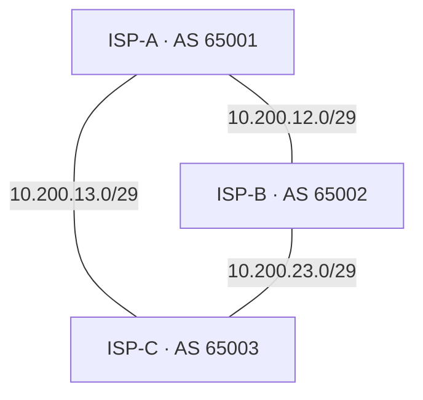

# Mini Internet

Three routers, three autonomous systems, and a link to turn off.

I built this lab to see what BGP does when a connection fails. Each router runs FRRouting in Docker and represents a small ISP. With all links up, A reaches C directly. When I disabled that link, BGP selected the route through B. After I restored it, A chose the direct route again.

## The network



| Router | Private ASN | Loopback |
|---|---|---|
| ISP-A | 65001 | 10.200.1.1/32 |
| ISP-B | 65002 | 10.200.2.1/32 |
| ISP-C | 65003 | 10.200.3.1/32 |

Each loopback gives its router an address that stays up when an individual link goes down. A `/32` route identifies exactly one IPv4 address.

| Link | First endpoint | Second endpoint | Docker bridge gateway |
|---|---|---|---|
| A–B | A: 10.200.12.2 | B: 10.200.12.3 | 10.200.12.1 |
| A–C | A: 10.200.13.2 | C: 10.200.13.3 | 10.200.13.1 |
| B–C | B: 10.200.23.2 | C: 10.200.23.3 | 10.200.23.1 |

The link subnets use `/29`. The third octet is a reminder of which routers connect: 12, 13, or 23. The .1 gateways belong to Docker's bridges; the BGP neighbors are the router endpoints.

## What I verified

Manual checks during the initial lab run:

| Stage | A's selected AS path to C | Ping replies | Reply TTL |
|---|---|---|---|
| All links up | 65003 | 4/4, 0% loss | 64 |
| A–C link disabled at A | 65002 65003 | 4/4, 0% loss | 63 |
| A–C link restored | 65003 | 4/4, 0% loss | 64 |

All three routers established two BGP neighbor sessions. A learned both a direct path to C's loopback and an alternative through B. With other relevant preferences equal, the shorter AS path won.

The pings were run **after** each route change. They confirm connectivity in each state; they do not measure convergence time or packet loss during the transition. The lower reply TTL during failover is consistent with the extra router on the return path.

## Run it

Requirements: Git, Docker Engine with the Compose plugin, and a Linux container environment. The initial run used an Ubuntu VM.

```bash
git clone https://github.com/PatienceEnoch/mini-internet.git
cd mini-internet
docker compose config --quiet
docker compose up -d
```

Check the BGP sessions:

```bash
for router in isp-a isp-b isp-c; do
  docker compose exec -T "$router" vtysh -c "show ip bgp summary"
done
```

Allow time for sessions to establish. Each router should show two neighbors, with a number under `State/PfxRcd` rather than a state such as `Idle` or `Active`. The initial run showed two received prefixes per neighbor.

Inspect A's routes and test C's loopback:

```bash
docker compose exec isp-a vtysh -c "show ip bgp"
docker compose exec isp-a ping -c 4 -I 10.200.1.1 10.200.3.1
```

`docker compose exec isp-a` runs the following command inside the running A container. In the ping, `-c 4` sends four packets and `-I 10.200.1.1` selects A's loopback as the source. C must have a route back to that address for the replies.

## Repeat the failover test

**1. Identify A's interface toward C.**

```bash
docker compose exec isp-a ip -br addr
```

Find the interface carrying `10.200.13.2/29`. It was `eth1` in the tested run. Verify the name on your own run before using the commands below; replace `eth1` if needed.

**2. Disable that lab interface.**

```bash
docker compose exec isp-a ip link set eth1 down
```

**3. Check the selected route, then test delivery.**

```bash
docker compose exec isp-a vtysh -c "show ip bgp 10.200.3.1/32"
docker compose exec isp-a ping -c 4 -I 10.200.1.1 10.200.3.1
```

After convergence, expect `65002 65003` to be marked `best`, with next hop `10.200.12.3`. If the change is still in progress, check again before recording results.

The destination remains C's loopback, `10.200.3.1`. Only the route to it changes.

**4. Restore the interface, including if a check fails.**

```bash
docker compose exec isp-a ip link set eth1 up
```

Allow the A–C session to reconnect, then repeat:

```bash
docker compose exec isp-a vtysh -c "show ip bgp 10.200.3.1/32"
docker compose exec isp-a ping -c 4 -I 10.200.1.1 10.200.3.1
```

Expect the direct path `65003` to become best again, with `65002 65003` retained as an alternative.

## Reading the route table

| Field | Meaning |
|---|---|
| Network | Destination prefix, such as C's 10.200.3.1/32 |
| Next Hop | Where this router forwards the packet next |
| Path | Autonomous systems along the advertised route |
| `*` | Valid BGP path |
| `>` | Selected best path |
| Trailing `i` | BGP origin code IGP; it does not mean this lab runs an IGP |

For example, destination `10.200.3.1/32`, next hop `10.200.12.3`, and path `65002 65003` mean: "To reach C's loopback, send to B first."

## Configuration

| File | Role |
|---|---|
| `compose.yaml` | Router containers, link networks, addresses, mounts, and resource settings |
| `routers/isp-*/daemons` | Enables bgpd and configures FRR processes |
| `routers/isp-*/frr.conf` | Loopback address, ASN, neighbors, and route filters |
| `routers/isp-*/vtysh.conf` | Empty CLI configuration file, mounted persistently to prevent missing-file warnings |

The image is pinned to `quay.io/frrouting/frr:10.7.1`. Each container has a 256 MiB memory limit and bounded Docker logs. IPv4 forwarding is enabled, and reverse-path filtering is disabled through the configured sysctls.

Inbound and outbound prefix lists permit only the three exact loopback prefixes. The three Docker link networks use `internal: true`, and no host ports are published. This lab does not peer with the public internet.

The containers receive `NET_ADMIN`, `NET_RAW`, and `SYS_ADMIN`. During setup, this FRR image failed to start its routing processes until the requested `SYS_ADMIN` capability was added. That is a broad capability: this configuration is intended for a trusted local lab environment.

## Stop and restart

Stop the containers while retaining them:

```bash
docker compose stop
```

Start the existing containers again:

```bash
docker compose start
```

Remove the lab containers and Docker networks:

```bash
docker compose down
```

The configuration files remain in the repository. Use `docker compose up -d` to recreate the lab.

## Next experiments

- Measure convergence and packet loss with a continuous ping during failure.
- Test failures on the other links.
- Change routing policy and compare it with the default AS-path choice.

These are planned experiments, not completed results.
